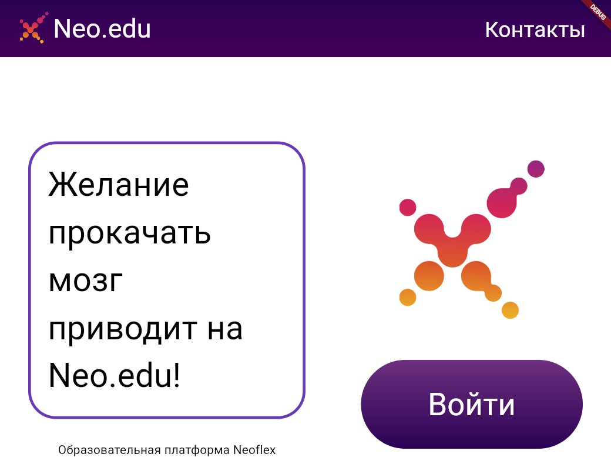

# Система управления обучением Neo.edu

Добро пожаловать в систему управления обучением Neo.edu! Это мощный инструмент для организации обучения, управления курсами и оценки студентов.

## Описание

Система управления обучением (LMS) предназначена для облегчения процесса обучения, как для преподавателей, так и для студентов. Она позволяет создавать курсы, загружать материалы,  и автоматически проверять задания.

## Установка

## Использование

## Пример

## Вклад

Если вы нашли ошибку или хотите предложить улучшение, пожалуйста, создайте issue или pull request в этом репозитории.

## Авторы

Авторы: Максим Левченко, Матвей Лежев, Анна Лунёва, Анастасия Медянкина, Дмитрий Никитин

Свяжитесь со мной: [lezhevmatvey@ya.ru](mailto:lezhevmatvey@ya.ru)

